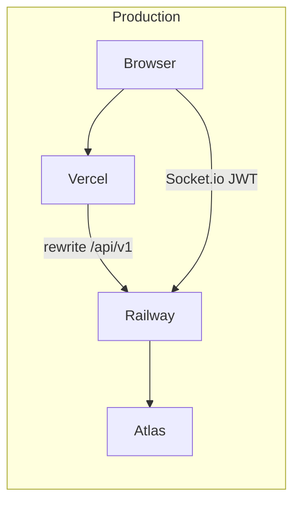
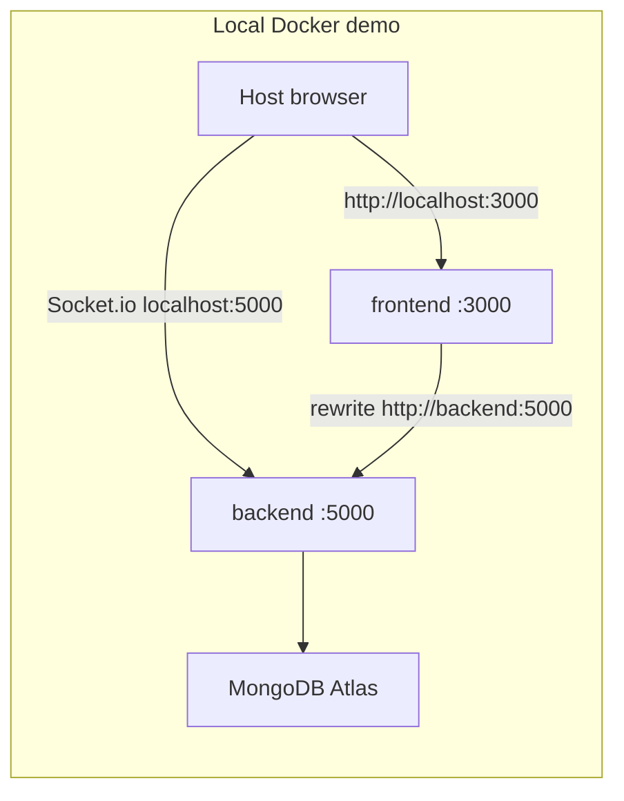

# Toys Factory ERP

A full-stack ERP for toy manufacturing and wholesale: sales, inventory, production, accounting, and HR in one product.

The project is two GitHub repositories. **This README is the full picture** — you do not need to open the other repo to understand the system.

| Repo | Contents |
| --- | --- |
| [himel2535/toys_factory_erp](https://github.com/himel2535/toys_factory_erp) | Next.js 16 app in `web/` (Vercel) |
| [himel2535/toys_factory_erp_backend](https://github.com/himel2535/toys_factory_erp_backend) | Express 5 + Mongoose + Socket.io API (Railway) |

[](https://nextjs.org/)
[](https://react.dev/)
[](https://expressjs.com/)
[](https://www.mongodb.com/atlas)
[](https://socket.io/)
[](https://vercel.com/)
[](https://railway.app/)
[](#local-docker-demo)

## Live

| Layer | Platform | Link |
| --- | --- | --- |
| App | Vercel | [https://toys-factory-erp-one.vercel.app](https://toys-factory-erp-one.vercel.app) |
| API + Socket.io | Railway | [https://toysfactoryerpbackend-production.up.railway.app](https://toysfactoryerpbackend-production.up.railway.app) |
| Health | Railway | [https://toysfactoryerpbackend-production.up.railway.app/health](https://toysfactoryerpbackend-production.up.railway.app/health) |
| Database | MongoDB Atlas | Shared cluster (not a container) |
| Frontend repo | GitHub | [himel2535/toys_factory_erp](https://github.com/himel2535/toys_factory_erp) |
| Backend repo | GitHub | [himel2535/toys_factory_erp_backend](https://github.com/himel2535/toys_factory_erp_backend) |

Production is **Vercel + Railway + Atlas**. Docker is a **laptop demo** on ports 3000 and 5000 only — there is no VPS deploy, and the Compose stack is not production-hardened.

## Architecture



- **REST in the browser** goes same-origin to `/api/v1`. Next.js rewrites that path to `NEXT_PUBLIC_API_URL` (Railway in production, the Express process locally).
- **Socket.io** does **not** go through the Next rewrite. The client uses `NEXT_PUBLIC_SOCKET_URL` (the API origin, with no `/api/v1` suffix). JWT is sent on the handshake (`auth.token`); REST still uses the HttpOnly cookie.



Inside Compose, Next must call the **service name** `backend`. The browser is not on that network, so Socket.io must use **`http://localhost:5000`** (the published port). Mixing those two URLs is the usual failure mode.

## Stack

**Frontend** ([`web/`](https://github.com/himel2535/toys_factory_erp/tree/main/web)): Next.js 16 (App Router, `output: 'standalone'`), React 19, TypeScript, Tailwind CSS v4, Zustand, Recharts, jsPDF, `socket.io-client`.

**Backend**: Node 20, Express 5, TypeScript, Mongoose 8, MongoDB Atlas, Socket.io 4, JWT (HttpOnly cookie + handshake), Helmet / compression / CORS with credentials, optional Redis with an in-memory Map fallback.

## Modules

- **Dashboard** — KPIs (revenue, dues, payables, low stock, production queue), charts, business-health alerts
- **Manufacturing** — BOM / recipes (RM, SF, FG), work orders, machine downtime, mold usage, wastage
- **Inventory** — multi-warehouse stock, transfers, adjustments, low-stock thresholds
- **Sales & CRM** — leads, quotations, sales orders, POS, dispatch, invoices, split payments
- **Purchases** — suppliers, POs, GRN, purchase returns
- **Accounting** — cashboxes, journals, trial balance, P&L, balance sheet, AR / AP
- **HR & payroll** — employees, attendance, leave, salary structures, payslip PDFs
- **Admin** — RBAC, audit log, company settings, document templates

## API surface

Default listen port is **5000** locally. In production the same routes are on the Railway origin.

| Path | Auth | Role |
| --- | --- | --- |
| `GET /health` | Public | Liveness |
| `GET /` | Public | Name, version, pointers |
| `/api/v1/auth` | Public login / first-admin register | JWT in HttpOnly cookie |
| `/api/v1/*` | `requireAuth` | ERP CRUD, reports, dashboard, notifications |
| Socket.io (same HTTP port) | Handshake `auth.token` (or cookie) | Live inbox events |

### Auth

- Login issues a JWT. Browsers send it as a **secure HttpOnly cookie** on REST.
- Socket.io cannot rely on that cookie across origins, so the client also stores the token and sends it on the handshake (`auth.token`).
- Shared verifier: [`authToken.ts`](https://github.com/himel2535/toys_factory_erp_backend/blob/main/src/middleware/authToken.ts).

## Multi-tenant model

The data layer is **tenant-scoped**, not a billed multi-org SaaS product.

| What exists | What it is not |
| --- | --- |
| Business documents carry `tenantId` (default `'default'`) | Per-company signup, billing, or a tenant switcher |
| Compound indexes such as `{ tenantId, legacyId }` and `{ tenantId, createdAt }` | A marketplace / multi-vendor store |
| Socket.io rooms `tenant:{id}` and `user:{id}` | Full row-level isolation from the JWT today |
| Shared MongoDB database, one cluster | Database-per-tenant |

The live deployment runs as a **single company**. User accounts do not store `tenantId`; list/filter endpoints still default to `tenantId=default`. The schema, indexes, and realtime rooms are in place so a second tenant can be isolated later without a rewrite of every collection.

## Realtime notifications (Socket.io)

Socket.io shares the Express HTTP server (same port as REST). Attach point: [`socket.ts`](https://github.com/himel2535/toys_factory_erp_backend/blob/main/src/realtime/socket.ts).

1. After login, the client connects with the access token on the handshake.
2. The server joins `tenant:{tenantId}` and `user:{userId}`.
3. Creating a **sales order** persists an inbox row and emits `notification:new`:

```json
{ "id": "...", "type": "sales_order", "message": "...", "refId": "...", "createdAt": "..." }
```

4. The header dropdown shows live items. On connect/reconnect the client **refetches** `GET /api/v1/notifications` so events missed while offline are not lost.

This is operational today for sales-order create (`POST /api/v1/sales-orders`). It is not a generic pub/sub for every module yet.

## Deployment

### Production — Vercel + Railway

| Piece | Where | Role |
| --- | --- | --- |
| Next.js (`web/`) | **Vercel** | UI; `/api/v1` rewrite to the Railway API |
| Express + Socket.io | **Railway** | REST, JWT, WebSocket, Atlas |
| MongoDB | **Atlas** | Source of truth |

Vercel env:

```text
NEXT_PUBLIC_API_URL=https://toysfactoryerpbackend-production.up.railway.app/api/v1
NEXT_PUBLIC_SOCKET_URL=https://toysfactoryerpbackend-production.up.railway.app
```

Railway env: `MONGODB_URI`, `CORS_ORIGIN` (must include `https://toys-factory-erp-one.vercel.app` and `http://localhost:3000` for local work), `JWT_SECRET`, optional `REDIS_URL`. Socket.io uses the same CORS list. Railway sets `PORT` (often `8080`) — that is the container port, not a public URL.

### Local development (npm)

Two terminals. Node 20+. Clone both repos as siblings.

```bash
# API — http://localhost:5000
cd toys_factory_erp_backend
npm install
cp .env.example .env   # set MONGODB_URI
npm run dev            # tsx watch
# npm run build && npm start
# npm test
```

`USE_MEMORY_DB=true` (or `npm run dev:memory`) uses in-memory Mongo for experiments. Leave `REDIS_URL` empty for the in-memory GET cache.

```bash
# App — http://localhost:3000
cd toys_factory_erp/web
npm install
cp .env.example .env.local
npm run dev
```

Open [http://localhost:3000/login](http://localhost:3000/login). Leave `NEXT_PUBLIC_API_URL=http://localhost:5000/api/v1` and `NEXT_PUBLIC_SOCKET_URL=http://localhost:5000`.

### Local Docker demo

**Scope:** run production-style images on your machine so both services come up on **localhost:3000** and **localhost:5000**. This is **not** a VPS deploy and is **not** production-grade hosting (no TLS reverse proxy, no secrets manager, Compose is not running on a server). Live production stays on Vercel + Railway.

MongoDB is still Atlas — there is no database container. Images run `node server.js` / `node dist/server.js` (no `next dev` live reload). Day-to-day coding should stay on npm.

- Frontend image: [Dockerfile](https://github.com/himel2535/toys_factory_erp/blob/main/Dockerfile) (build context `web/`, Next standalone, port 3000)
- Backend image: [Dockerfile.local](https://github.com/himel2535/toys_factory_erp_backend/blob/main/Dockerfile.local) (multi-stage `tsc`, `EXPOSE 5000`). Named `.local` so Railway keeps Nixpacks and does not treat this as the production image.

Layout (parent folder is not a GitHub monorepo; clone both repos as siblings):

```text
parent/
  docker-compose.yml          # local workspace file (not in either GitHub repo)
  toys_factory_erp/
  toys_factory_erp_backend/
```

```bash
# from the parent folder that contains both clones
docker compose up --build
```

Then: app [http://localhost:3000](http://localhost:3000) · health [http://localhost:5000/health](http://localhost:5000/health).

| Who calls | Variable | Docker value | Why |
| --- | --- | --- | --- |
| Next rewrite / SSR **inside** the frontend container | `NEXT_PUBLIC_API_URL` | `http://backend:5000/api/v1` | `localhost` inside that container is Next, not the API |
| Socket.io **in the host browser** | `NEXT_PUBLIC_SOCKET_URL` | `http://localhost:5000` | The browser cannot resolve the Compose hostname `backend` |

`NEXT_PUBLIC_*` is inlined at **image build** time. After changing those values, rebuild the frontend image.

## Engineering notes

- **Cache:** optional Redis for heavy GET responses; empty `REDIS_URL` falls back to an in-memory map with TTL. Mutations clear related prefixes.
- **Ledger consistency:** Mongoose post-save hooks keep invoice paid/due and customer `totalDue` in sync; a boot-time pass reconciles customer dues from invoices.
- **Queries:** compound indexes include `tenantId`; list endpoints paginate and project fields; `.lean()` on read-only aggregations.
- **Client:** inflight GET deduplication in the API client so parallel mounts share one request.
- **Dashboard:** server fetch uses `cache: 'no-store'`, then the client refreshes on mount.

## Environment

| File | Purpose |
| --- | --- |
| [Frontend `.env.example`](https://github.com/himel2535/toys_factory_erp/blob/main/web/.env.example) | `NEXT_PUBLIC_API_URL`, `NEXT_PUBLIC_SOCKET_URL` |
| [Backend `.env.example`](https://github.com/himel2535/toys_factory_erp_backend/blob/main/.env.example) | `PORT`, `MONGODB_URI`, `CORS_ORIGIN`, `JWT_SECRET`, `REDIS_URL` |

Do not commit `.env` / `.env.local`.
