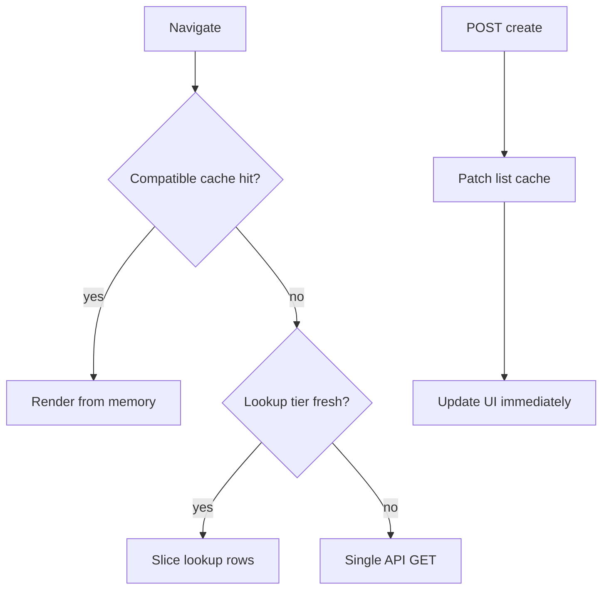

# Navigation Performance — Before/After (Cache Tiers + Mutation Fix)

Measured after two-tier cache, RSC prefetch removal, and targeted mutation patches.

## Key improvements

| Area | Before | After |
|---|---|---|
| Cache keys | Mismatched limits (8/10/25/200) → duplicate GETs | Lookup tier (`limit=100`) + compatible cache reads |
| Master data TTL | 10–15s global | 5 min for categories/units/warehouses |
| Sidebar hover | `router.prefetch()` → `?_rsc=` storm | Removed — `prefetch={false}` only |
| Product create | invalidate all + full reload + hydrator re-fetch + alerts | Cache patch + skip hydrator mutation refetch |
| Backend mutations | Sync `clearCaches()` before response | `setImmediate(clearCaches)` after response |

## Verification targets

| Scenario | Target |
|---|---|
| Dashboard → Products (warm, within 15s of dashboard boot) | 0 list GETs |
| Dashboard → Products (cold) | ≤1 list GET (`products` only) |
| Sidebar hover 5 links | 0 `?_rsc=` prefetches |
| Product create | 1 POST; 0 blocking list GETs after save |

## Scripts

```bash
node scripts/verify-route-hydration.mjs
node scripts/run-navigation-perf.mjs
```

Results: [`navigation-perf-results.json`](./navigation-perf-results.json)

## Architecture



## Files changed

- [`web/lib/services/api-list-cache.ts`](../lib/services/api-list-cache.ts) — lookup tier, compatible reads, cache patches
- [`web/lib/config/cache-policy.ts`](../lib/config/cache-policy.ts) — master data TTL
- [`web/lib/config/route-hydration-config.ts`](../lib/config/route-hydration-config.ts) — route-specific hydrator queries
- [`web/components/providers/ApiStateHydrator.tsx`](../components/providers/ApiStateHydrator.tsx) — compatible cache, no mutation re-fetch
- [`web/hooks/use-paginated-api-resource.ts`](../hooks/use-paginated-api-resource.ts) — targeted mutation patches
- [`web/components/layout/Sidebar.tsx`](../components/layout/Sidebar.tsx) — removed hover prefetch
- [`toys_factory_erp_backend/src/controllers/crudFactory.ts`](../../toys_factory_erp_backend/src/controllers/crudFactory.ts) — async cache invalidation
